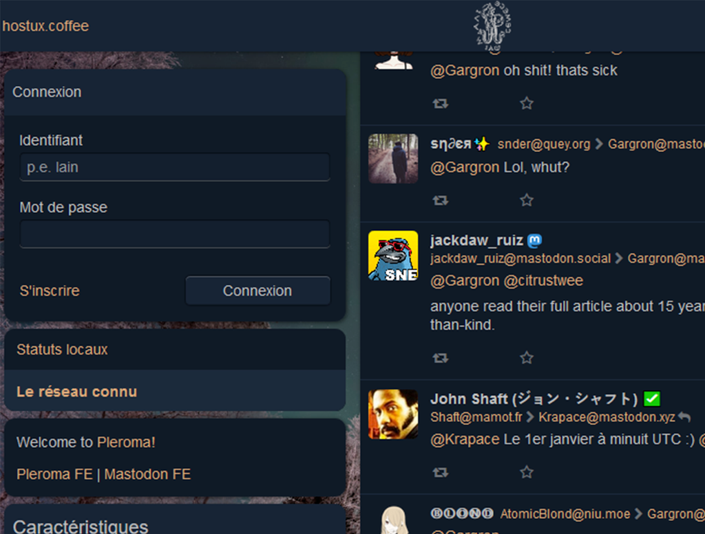

<!--
N.B.: This README was automatically generated by https://github.com/YunoHost/apps/tree/master/tools/README-generator
It shall NOT be edited by hand.
-->

# Pleroma pour YunoHost

[](https://dash.yunohost.org/appci/app/pleroma)  

[](https://install-app.yunohost.org/?app=pleroma)

*[Read this readme in english.](./README.md)*

> *Ce package vous permet d’installer Pleroma rapidement et simplement sur un serveur YunoHost.
Si vous n’avez pas YunoHost, regardez [ici](https://yunohost.org/#/install) pour savoir comment l’installer et en profiter.*

## Vue d’ensemble

Pleroma est un logiciel serveur de microblog qui peut fédérer (c’est à dire échanger des messages) avec d’autres serveurs qui supportent le protocole ActivityPub. Cela signifie que vous pouvez héberger un serveur pour vous ou vos amis et garder le contrôle de votre identité en ligne, tout en communiquant avec des personnes hébergées sur des serveurs différents et plus importants tel que Friendica, GNU Social, Hubzilla, Mastodon, Misskey, Peertube, ou Pixelfed.

Pour des informations plus détaillées sur Pleroma voir [What is Pleroma](https://blog.soykaf.com/post/what-is-pleroma/)

**Interface utilisateur Mastodon pour Pleroma :** Ajouter `/web` à la fin du nom de domaine (URL) de votre installation, par exemple : `https://pleroma.domain.tld/web`


**Version incluse :** 2.5.1~ynh2

## Captures d’écran



## Avertissements / informations importantes

## Limitations

- Pleroma doit impérativement s’installer sur son propre **nom de domaine dédié** (ou sous-domaine), par ex. pleroma.domain.tld
- Pleroma nécessite par ailleurs un **certificat SSL** valide activé sur ce domaine. Yunohost peut installer et configurer un **certificat Letsencrypt** pour le domaine depuis l’interface d'administration de Yunohost ou avec la ligne de commande.
- Ce paquet est actuellement configuré pour une **instance unique**, c’est-à-dire que l’on ne peut installer _qu’une seule instance_ de Pleroma sur un même serveur Yunohost.
- Le **mot de passe** saisi durant l’installation ne doit _en aucun cas_ contenir de **caractères spéciaux**. (Voir [issue #132](https://github.com/YunoHost-Apps/pleroma_ynh/issues/132))
- L’authentification LDAP fonctionne, mais pas `HTTP auth` en revanche.

## Tâches d’administration

Se connecter avec SSH à votre serveur Yunohost avec le compte admin (nous parlons ici de l’admin YNH pas de l’admin de Pleroma).
Pour la syntaxe des commandes, garder en tête les spécificités d’une installations de [Pleroma avec Yunohost](./doc/yunohost_fr.md).


### Ajouter un utilisateur ou utilisatrice

```
sudo su pleroma -s $SHELL -lc "/var/www/pleroma/live/bin/pleroma_ctl user new <userName> <userEmail>"
```

### Changer de mot de passe

```
sudo su pleroma -s $SHELL -lc "/var/www/pleroma/live/bin/pleroma_ctl user reset_password <userName>"
```

Ceci générera un **lien de réinitialisation** (URL) du mot de passe, que vous pouvez envoyer à l’utilisateur ou utilisatrice.

### Modérateurs

Vous pouvez donner à des utilisateurs ou utilisatrices les droits de **modération**. Ils ou elles pourront alors _supprimer_ n’importe quel billet publié par n’importe quel autre compte.

```
sudo su pleroma -s $SHELL -lc "/var/www/pleroma/live/bin/pleroma_ctl user set <userName> --admin"
```

Note : l’option `--admin` donne au compte _les droits de moderation_ et avec l’option `--no-admin` à l’inverse on _enlève_ les privilèges de modération de celui-ci.

## Documentations et ressources

* Site officiel de l’app : <https://pleroma.social/>
* Documentation officielle de l’admin : <https://docs.pleroma.social/>
* Dépôt de code officiel de l’app : <https://git.pleroma.social/pleroma/pleroma/>
* Documentation YunoHost pour cette app : <https://yunohost.org/app_pleroma>
* Signaler un bug : <https://github.com/YunoHost-Apps/pleroma_ynh/issues>

## Informations pour les développeurs

Merci de faire vos pull request sur la [branche testing](https://github.com/YunoHost-Apps/pleroma_ynh/tree/testing).

Pour essayer la branche testing, procédez comme suit.

``` bash
sudo yunohost app install https://github.com/YunoHost-Apps/pleroma_ynh/tree/testing --debug
ou
sudo yunohost app upgrade pleroma -u https://github.com/YunoHost-Apps/pleroma_ynh/tree/testing --debug
```

**Plus d’infos sur le packaging d’applications :** <https://yunohost.org/packaging_apps>